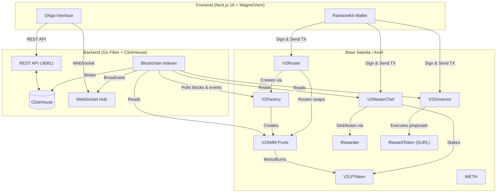

# 🔄 DeFi AMM DEX (V2 Constant Product)

A full-stack decentralized exchange built on **Uniswap V2 architecture** — featuring constant-product AMM pools, multi-hop routing, MasterChef staking rewards, on-chain governance, real-time analytics with OHLCV charts, and a blockchain event indexer. Designed as a modular extension of the [URL Shortener Web3 ecosystem](../README.md), sharing the same token infrastructure and Docker network.

---

## 🏗️ System Architecture



---

## 🛠️ Technology Stack

| Layer | Technology |
| :--- | :--- |
| **Smart Contracts** | Solidity 0.8.26, Hardhat, OpenZeppelin v5, Bun |
| **Backend** | Go 1.26+, Fiber v2, ClickHouse, go-ethereum, Zap, Viper, WebSocket |
| **Frontend** | Next.js 16, React 19, TypeScript, TailwindCSS 4, Wagmi 2, Viem 2, RainbowKit, TanStack Query, Zustand, lightweight-charts, Sonner |
| **Infrastructure** | Docker Compose, Nginx (Reverse Proxy), golang-migrate (ClickHouse), S3/Garage (token logos) |

---

## ⚡ Key Features

* **Constant-Product AMM** — V2-style `x * y = k` pools with 0.3% swap fee (997/1000), per-pair ERC20 LP tokens, and automatic reserve rebalancing.
* **V2Factory + V2Router** — Factory creates and tracks all pair contracts. Router provides atomic multi-hop swaps (`swapExactTokensForTokens`, `swapExactETHForTokens`, `swapExactTokensForETH`) with deadline protection and auto-pair-creation on first liquidity.
* **MasterChef Staking** — Deposit LP tokens, earn SURL rewards via per-pool Rewarder contracts with configurable `rewardPerSecond` and `totalRewardCap`. Role-based admin control.
* **On-Chain Governance** — V2Governor with proposal creation, for/against/abstain voting weighted by ERC20Votes (`getPastVotes`), quorum enforcement, and on-chain execution of arbitrary calldata.
* **Real-Time Analytics** — TVL, 24h volume, pair-level stats, token prices, OHLCV TradingView-style charts. BFS-based price resolver walks the pool graph from stablecoin/WETH base.
* **Live Event Indexing** — Separate Go indexer process discovers pools on-chain, polls blocks, indexes swaps/liquidity/staking/governance events into ClickHouse, and broadcasts to frontend via WebSocket.
* **Dynamic Config** — Frontend fetches contract addresses and chain config from backend `/api/config` at runtime. No hardcoded addresses in the frontend.

---

## 📁 Project Structure

```
defi-amm-dex/
├── contracts/              # Solidity smart contracts & Hardhat project
│   ├── contracts/
│   │   ├── V2AMM.sol           # Core constant-product pool
│   │   ├── V2LPToken.sol       # ERC20 LP token (per-pair)
│   │   ├── V2Factory.sol       # Pair creation & tracking
│   │   ├── V2Router.sol        # User-facing swap & liquidity router
│   │   ├── WETH.sol            # Wrapped Ether
│   │   ├── V2MasterChef.sol    # LP staking with rewards
│   │   ├── Rewarder.sol        # Per-pool reward distributor
│   │   ├── IRewarder.sol       # Rewarder interface
│   │   ├── V2Governor.sol      # On-chain governance
│   │   └── mocks/
│   │       └── MockToken.sol   # Test ERC20
│   ├── scripts/
│   │   ├── v2-deploy-dev.ts    # Local dev deployment (WETH, USDC, Factory, Router, MasterChef)
│   │   ├── v2-deploy-prod.ts   # Production deployment
│   │   └── send-tokens-dev.ts  # Distribute test tokens
│   ├── test/
│   │   ├── v2-amm.test.ts      # AMM pool tests
│   │   └── v2-router.test.ts   # Router tests
│   ├── config.ts               # Production contract addresses
│   ├── hardhat.config.ts       # Compiler & network config
│   └── .env.example
├── backend/                # Go API server & event indexer
│   ├── cmd/
│   │   ├── api/main.go         # REST API server (:8081)
│   │   └── indexer/main.go     # Blockchain event indexer
│   ├── internal/
│   │   ├── config/config.go    # Viper-based configuration
│   │   ├── v2/api/             # HTTP handlers (dex, staking, analytics, history, ws, config)
│   │   ├── v2/service/         # Business logic (dex, staking, analytics, history, pricer)
│   │   ├── v2/indexer/         # Block polling, event parsing, pool discovery
│   │   ├── v2/ws/              # WebSocket hub
│   │   ├── v2/db/              # ClickHouse migrations (7 total)
│   │   └── service/token.go    # ERC20 registration + S3 logo upload
│   ├── Dockerfile.dev / Dockerfile.prod / Dockerfile.migrate
│   ├── .air.toml / .air.indexer.toml   # Hot-reload configs
│   └── entrypoint.dev.sh       # Loads shared contract addresses at startup
├── frontend/               # Next.js 16 DApp
│   ├── app/
│   │   ├── page.tsx                # Marketing landing page
│   │   ├── dex/v2/swap/            # Token swap panel
│   │   ├── dex/v2/liquidity/       # Pool list + add/remove liquidity
│   │   ├── dex/v2/staking/         # MasterChef staking pools
│   │   ├── dex/v2/analytics/       # TVL/volume dashboard + pair detail (OHLCV)
│   │   └── governance/             # Proposals, voting, delegation
│   ├── lib/
│   │   ├── wagmi.ts            # Dynamic chain config from backend
│   │   └── abis.ts             # Full ABI definitions
│   ├── hooks/                # useSwap, usePairs, useStaking, useGovernance, useAnalytics, etc.
│   ├── stores/               # Zustand stores (config, swap, liquidity, tx)
│   └── providers.tsx         # QueryClient + Wagmi + RainbowKit + NetworkGuard + TxSocket
├── nginx/                  # Reverse proxy configs
│   ├── dev.conf
│   └── prod.conf
├── docker-compose.dev.yml  # 7 services (ClickHouse, contracts, migrate, API, indexer, frontend, nginx)
└── docker-compose.prod.yml # Production stack
```

---

## 🚀 Step 1: Local Development Setup

This project runs as part of the parent `short-url-generator` Docker network. The parent project's Anvil node and deployed `RewardToken` (SURL) are prerequisites.

### Prerequisites

1. **Parent project running** — Ensure the parent project's Anvil node is up:
   ```bash
   cd ../
   docker compose -f docker-compose.dev.yml up -d anvil-node
   ```

2. **Parent web3 contracts deployed** — The base `RewardToken` must be deployed by the parent's `deploy-web3` service (writes addresses to the shared `web3_data` volume).

### 1. Configure Contract Environment

```bash
cd defi-amm-dex/contracts
cp .env.example .env
```

Fill in your `.env`:
```ini
RPC_URL=http://anvil-node:8545
HARDHAT_RPC_URL=http://anvil-node:8545
DEPLOYER_PRIVATE_KEY=0xac0974bec39a17e36ba4a6b4d238ff944bacb478cbed5efcae784d7bf4f2ff80
ETHERSCAN_API_KEY=YOUR_KEY
```

### 2. Configure Backend Environment

```bash
cd ../backend
cp .env.example .env
```

Key variables (dev defaults are auto-detected by `entrypoint.dev.sh`):
```ini
# ClickHouse
CLICKHOUSE_URL=clickhouse://clickhouse:9000/default

# EVM / Chain
EVM_RPC_URL=http://anvil-node:8545
CHAIN_ID=31337
CHAIN_NAME=Anvil

# Contract addresses (auto-loaded from shared volume in dev)
CONTRACT_V2_FACTORY=0x...
CONTRACT_V2_ROUTER=0x...
CONTRACT_WETH=0x...
CONTRACT_STAKING=0x...
CONTRACT_REWARD_TOKEN=0x...

# Indexer
SYNC_INTERVAL=3s
```

### 3. Launch the Dev Stack

From the `defi-amm-dex/` root:

```bash
docker compose -f docker-compose.dev.yml up -d --build
```

This spins up **7 services**:

| Service | Description |
| :--- | :--- |
| `clickhouse` | ClickHouse database (ports 8123, 9000) |
| `deploy-contracts` | Runs Hardhat deploy script, writes addresses to shared volume |
| `clickhouse-migrate` | Applies pending ClickHouse migrations |
| `backend-api` | Go API server with Air hot-reload (`:8081`) |
| `backend-indexer` | Go blockchain event indexer with Air hot-reload |
| `frontend` | Next.js dev server |
| `nginx` | Reverse proxy (`:80`) |

### 4. Access the DApp

Open **http://localhost** in your browser. Connect a wallet via RainbowKit and start swapping, providing liquidity, staking, and voting.

---

## 🐳 Step 2: Production Deployment

### 1. Deploy Smart Contracts to Base Sepolia

```bash
cd contracts
cp .env.example .env
# Set RPC_URL to your Base Sepolia endpoint
# Set DEPLOYER_PRIVATE_KEY to a funded wallet
```

Edit `config.ts` with your production `RewardToken` address:
```typescript
export const CONTRACT_ADDRESSES = {
  token: "0x...",    // RewardToken proxy address from parent project
  stakingOwner: "0x...",
  outputFile: "deployed-addresses.txt",
};
```

Deploy:
```bash
npx hardhat run scripts/v2-deploy-prod.ts --network remote
```

### 2. Configure Production Backend

```bash
cd ../backend
cp .env.example .env
```

Set production values:
```ini
CLICKHOUSE_URL=clickhouse://clickhouse:9000/default
EVM_RPC_URL=https://base-sepolia.infura.io/v3/YOUR_PROJECT_ID
CHAIN_ID=84532
CHAIN_NAME=Base Sepolia
EXPLORER_URL=https://sepolia.basescan.org

# Contract addresses from deployed-addresses.txt
CONTRACT_V2_FACTORY=0x...
CONTRACT_V2_ROUTER=0x...
CONTRACT_WETH=0x...
CONTRACT_STAKING=0x...
CONTRACT_REWARD_TOKEN=0x...
CONTRACT_GOVERNOR=0x...
CONTRACT_STABLECOIN=0x...
```

### 3. Launch Production Stack

From the `defi-amm-dex/` root:

```bash
docker compose -f docker-compose.prod.yml up -d --build
```

The production stack uses:
- Multi-stage Docker builds (minimal Alpine images)
- Read-only containers with `tmpfs` mounts
- ClickHouse ports bound to `127.0.0.1` only
- Gzip compression and immutable caching in Nginx

---

## 📡 API Reference

### ⚙️ Config
```http
GET  /api/config              - Contract addresses + chain config (served to frontend)
GET  /api/health              - Health check
```

### 🔄 DEX
```http
GET  /api/v2/dex/pairs        - All trading pairs with TVL & 24h volume
GET  /api/v2/dex/tokens       - Paginated token list with search (?page=&limit=&search=)
```

### 📊 Analytics
```http
GET  /api/v2/analytics/overview            - Global TVL, volume, pair count
GET  /api/v2/analytics/tvl-history         - TVL time series
GET  /api/v2/analytics/volume-history      - Volume time series
GET  /api/v2/analytics/pairs/:poolId       - Individual pair analytics
GET  /api/v2/analytics/pairs/:poolId/price-history  - Price time series
GET  /api/v2/analytics/pairs/:poolId/ohlcv          - OHLCV candlestick data
GET  /api/v2/analytics/tokens              - Token prices
GET  /api/v2/analytics/staking/apr         - Staking APR data
```

### 🥩 Staking
```http
GET  /api/v2/staking/pools?user=0x...     - Staking pool info (on-chain reads)
```

### 📜 History
```http
GET  /api/v2/history?address=0x...&type=swap&=liquidity&staking&governance&page=1&limit=20
```

### 🔌 WebSocket
```ws
WS   /api/v2/ws?address=0x...             - Real-time transaction events for address
POST /api/v2/internal/broadcast            - Internal: indexer → API event relay
```

### 🪙 Tokens
```http
POST /api/tokens                           - Register new ERC20 (reads on-chain metadata, uploads logo to S3)
```

---

## 🗃️ Database Schema (ClickHouse)

The indexer uses **7 migration tables** across two engine types:

| Table | Engine | Purpose |
| :--- | :--- | :--- |
| `pairs` | ReplacingMergeTree | Trading pools: reserves, TVL, 24h volume |
| `tokens` | ReplacingMergeTree | Token registry: address, symbol, decimals, logo |
| `swaps` + `swaps_by_user` | MergeTree | Swap events indexed by pool and user |
| `price_snapshots` | MergeTree | Time-series price data |
| `tvl_snapshots` | MergeTree | Time-series TVL data |
| `liquidity_events` | MergeTree | Add/remove liquidity events |
| `staking_events` | MergeTree | Deposit/withdraw/harvest events |
| `governance_events` | MergeTree | Proposals, votes, executions |

---

## 🧪 Running Tests

```bash
# Smart contract tests (from contracts/)
cd contracts && npx hardhat test

# Go backend unit tests (from backend/)
cd backend && go test ./...

# Frontend lint (from frontend/)
cd frontend && bun run lint
```

---

## 🔗 Parent Project Integration

This DEX is designed to work within the `short-url-generator` ecosystem:

| Shared Resource | Description |
| :--- | :--- |
| **Docker Network** | `short-url-network` — shared bridge network for Anvil node communication |
| **Reward Token (SURL)** | Parent project's `RewardToken` is the staking reward token |
| **Web3 Data Volume** | `web3_data` — shared volume containing deployed addresses and S3 credentials |
| **Anvil Node** | Parent project's local Ethereum node for development |

---

## 📄 License

This project is licensed under the MIT License - see the [LICENSE](LICENSE) file for details.
